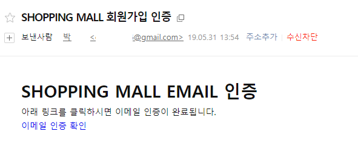

# ShoppingMall
Web ShoppingMall 입니다.

## 시연 영상 보러가기(이미지를 클릭해주세요.)

## 기술 스택
* HTML
* CSS(BootStrap 4)
* javascript(jQuery)
* Ajax
* java/jsp
* Spring Framework
* MySql(MyBatis)

### library
* javax.mail 1.4.7
* gson 2.8.5
* thumbnailator 0.4.8
* commons-fileupload 1.4

### Open API
* 스마트 택배 배송조회 (https://tracking.sweettracker.co.kr/)
* 네이버 로그인 캡차 (https://developers.naver.com/products/captcha/)
* 우편번호 서비스 (http://postcode.map.daum.net/guide)

#### DataBase

## 프로그램 설명

### 회원가입

#### 캡차

joinform 접속 시에 Naver캡차 키를 이용하여 캡차 이미지와 캡차 코드를 발급받습니다.

이미지는 서버에 저장된 후 Ajax 통신을 통해 비동기적으로 클라이언트에게 저장된 이미지를 보여줍니다.

클라이언트 입력 코드와 서버에 저장된 코드를 비교하여 회원가입을 인증합니다. 

NaverCaptchaAPI

#### 메일 

회원가입 시 메일인증이 필요합니다.

데이터베이스에 메일인증 여부와 메일인증에 필요한 키 값이 저장됩니다.

서버는 회원가입과 동시에 회원이 가입한 메일에 링크와 함께 키값을 발급합니다.

링크 접속 시 controller에 의해 DB의 키값과 링크 키값을 비교해 인증을 완료합니다. 

### 이미지 업로드

registerForm 에서 보내온 파일을 commons-fileupload 을 이용해 서버에서 파일을 전송받습니다.

전송된 파일을 이미지 파일로 변환시키고 thumbnailator 를 이용 이미지 파일을 서버 단에서 크기를 조정합니다. 
※(파일 용량 줄이기)

### 주소 찾기

### 운송 정보

ajax 통신을 이용 key,code,invoice 를 get 방식으로 스마트 택배 배송API 에서 운송 정보를 JSON 형태로 받아와 필요한 정보를 조합하여 클라이언트에게 보여줍니다.
